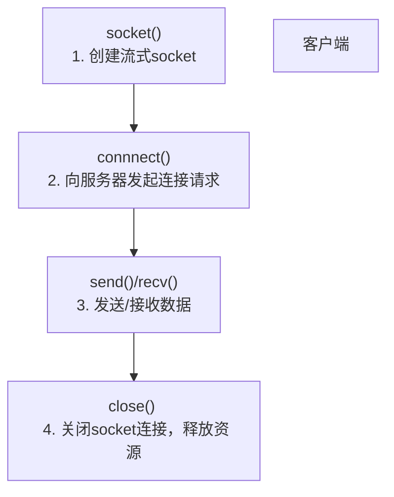
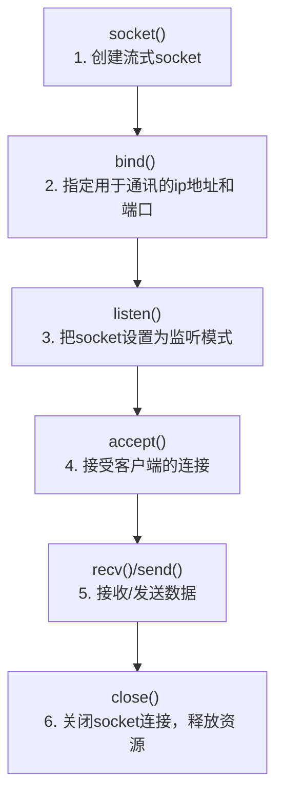

# C/C++

## inline 与 static

```markdown
非类的成员函数以及成员变量
inline修饰的函数或变量（c++17开始可以修饰变量）在全局保留一份；

static修饰的函数或者变量会在各自的编译单元都保留一份；

static函数的局部static变量也会有多份，inline函数的static变量只有一份;

static inline 修饰的函数或者变量与static单独修饰的效果一致；

inline 不能修饰局部变量；

有关类的成员函数以及成员变量
类的非const静态成员变量初始化，C++ 17可以通过static inline 在类内直接初始化，C++17之前必须在类外初始化（const static 修饰的变量也可以类内初始化，这个在之前也是可以的）；

C++17之后，类的静态成员变量在类内通过static声明，在类外（但是在头文件中）初始化不加inline的话可能会导致重定义从而出现链接错误，而加了inline 就不会出错，类似有无inline修饰的全局函数；

C++ 17之前必须在.cpp中初始化静态成员才不会出现重定义的错误，在.h中初始化还是会导致重定义错误，因为C++17之前的标准不支持inline修饰类的静态成员变量；

类中的函数其实可以认为是都隐式加了inline的，因为类中的所有函数在全局都只有一份，而有无static修饰只是限制该函数对类数据成员的使用（类的static函数只能使用static成员变量，类的普通成员函数可以使用所有的成员变量 ）；

 inline使用场景：(1)、可以使用inline函数完全取代表达式形式的宏定义；(2)、内联函数一般只会用在函数内容非常简单的时候，这是因为，内联函数的代码会在任何调用它的地方展开，如果函数太复杂，代码膨胀带来的恶果很可能会大于效率的提高带来的益处。
 
 内联函数可减少cpu的系统开销，并且程序的整体速度将加快，但当内联函数很大时，会有相反的作用，因此一般比较小的函数才使用内联函数．
 
  内联是一种对编译器的请求，下面这些情况会阻止编译器服从这项请求：如果函数中包含有循环，switch或goto语句，递归函数，含有static的函数．
  
   static inline，静态内联函数，它不使用函数调用，直接将汇编代码插入在调用该函数处。
   static inline，可以把它认为是一个static的函数，加上了inline的属性。static inline函数和static函数一样，其定义的范围是local的，即可以在程序内有多个不同的定义(只要不位于同一个文件内即可)。
   
   
```


## I/O 多路复用

### select
​	fd_set 使用数组实现  
​		1.fd_size 有限制 1024 bitmap
​			fd【i】 = accept()
​		2.fdset不可重用，新的fd进来，重新创建
​		3.用户态和内核态拷贝产生开销
​		4.O(n)时间复杂度的轮询
​		成功调用返回结果大于 0，出错返回结果为 -1，超时返回结果为 0
​		具有超时时间

### poll
​	基于结构体存储fd
​	struct pollfd{
​		int fd;
​		short events;
​		short revents; //可重用
​	}
​	解决了select的1,2两点缺点

### epoll
​	解决select的1，2，3，4
​	不需要轮询，时间复杂度为O(1)
​	epoll_create  创建一个白板 存放fd_events
​	epoll_ctl 用于向内核注册新的描述符或者是改变某个文件描述符的状态。已注册的描述符在内核中会被维护在一棵红黑树上
​	epoll_wait 通过回调函数内核会将 I/O 准备好的描述符加入到一个链表中管理，进程调用 epoll_wait() 便可以得到事件完成的描述符

​	两种触发模式：
​		LT:水平触发
​			当 epoll_wait() 检测到描述符事件到达时，将此事件通知进程，进程可以不立即处理该事件，下次调用 epoll_wait() 会再次通知进程。是默认的一种模式，并且同时支持 Blocking 和 No-Blocking。
​		ET:边缘触发
​			和 LT 模式不同的是，通知之后进程必须立即处理事件。
​			下次再调用 epoll_wait() 时不会再得到事件到达的通知。很大程度上减少了 epoll 事件被重复触发的次数，
​			因此效率要比 LT 模式高。只支持 No-Blocking，以避免由于一个文件句柄的阻塞读/阻塞写操作把处理多个文件描述符的任务饿死。


# 网络编程

客户端



服务器端



