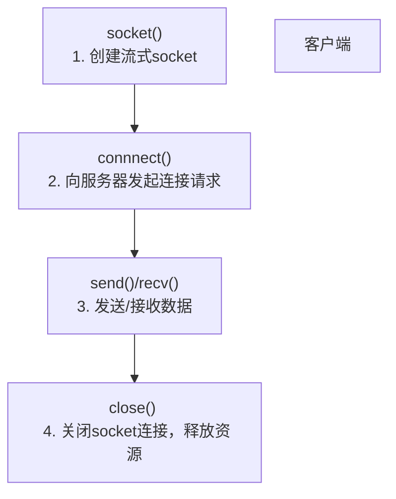
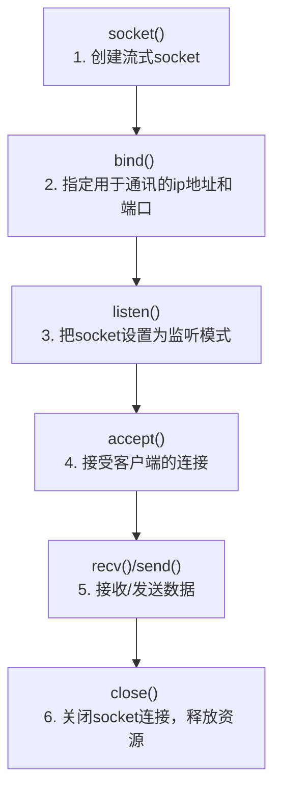
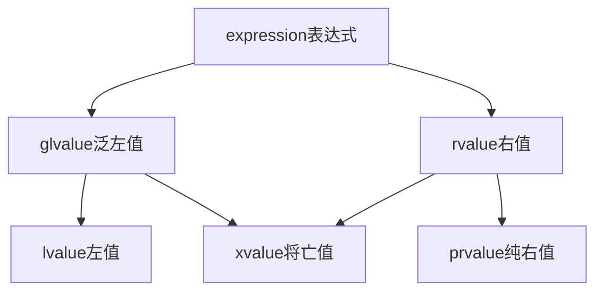

# C

## 文件操作

文件的打开
fopen()：打开文件
文件的关闭
fclose()：关闭文件

文件的读写
fgetc()：读取一个字符   int fgetc ( FILE * stream );
fputc()：写入一个字符   int fputc( int c, FILE *stream );

fgets()：读取一个字符串 char * fgets ( char * str, int num, FILE * stream );
fputs()：写入一个字符串 int fputs( const char *string, FILE *stream );

fprintf()：写入格式化数据
fscanf()：格式化读取数据

fread()：读取数据   size_t fread ( void * ptr, size_t size, size_t count, FILE * stream );
fwrite()：写入数据  size_t fwrite ( const void * ptr, size_t size, size_t count, FILE * stream );

文件状态检查
feof()：文件是否结束
ferror()：文件读/写是否出错
clearerr()：清除文件错误标志
ftell()：文件指针的当前位置

文件指针定位
rewind()：把文件指针移到开始处
fseek()：重定位文件指针

## 二维数组

数组指针 != 指针数组

```c++
    // [] 优先级比 * 高
    int (*p)[3] = new int[3][3];

    int **p = new int*[3]
        //传参数
    void matrix_mutifly(int (*A)[10], int (*B)[10], int (*C)[10]){}
```

## 编译指令
### `__attritube__`
设置编译属性，例如:
- `__attribute__((packed))`：以紧凑的方式对齐结构体或变量，减小内存占用。
- `__attribute__((aligned(n)))`：将结构体或变量对齐到指定的字节边界。
- `__attribute__((noreturn))`：用于表示函数不会返回，例如在函数内部调用 `exit()` 或执行无限循环。
- `__attribute__((unused))`：用于消除未使用变量的编译警告。
### `__weak`
弱定义，正常不带此修饰符为强定义
多强报错，弱强用强，多弱用占内存最大的


## 宏定义
### offsetof宏
```C
#define offsetof(TYPE, MEMBER) ((size_t) &((TYPE *)0)->MEMBER)
```

(1)offsetof宏的作用是：用宏来计算结构体中某个元素和结构体首地址的偏移量（其实质是通过编译器来帮我们计算）。

(2)offsetof宏的原理：我们虚拟一个type类型结构体变量，然后用type.member的方式来访问那个member元素，继而得到member相对于整个变量首地址的偏移量。

### container_of宏
```C
 #define container_of(ptr, type, member) ({   \
     const typeof( ((type *)0)->member ) *__mptr = (ptr); \
     (type *)( (char *)__mptr - offsetof(type,member) );})

```

知道一个结构体中某个元素的指针，反推这个结构体变量的指针。有了container_of宏，我们可以从一个元素的指针得到整个结构体变量的指针，继而得到结构体中其他元素的指针。

### 
# 函数指针与回调函数
## 函数指针
```C
// 普通函数声明
int func(int a);
// 函数指针初始化
int (*p_func)(int) = func;
// 函数指针调用
p_func(5);              

```

```C
#include <stdio.h>
 
int max(int x, int y)
{
    return x > y ? x : y;
}
 
int main(void)
{
    /* p 是函数指针 */
    int (* p)(int, int) = & max; // &可以省略
    int a, b, c, d;
 
    printf("请输入三个数字:");
	scanf("%d %d %d", & a, & b, & c);
 
    /* 与直接调用函数等价，d = max(max(a, b), c) */
    d = p(p(a, b), c); 
 
    printf("最大的数字是: %d\n", d);
 
    return 0;
}
```

## 回调函数 Callback Function
函数指针变量可以作为某个函数的参数来使用的，回调函数就是一个通过函数指针调用的函数。

简单讲：回调函数是由别人的函数执行时调用你实现的函数。

回调函数通常是在特定的事件或条件发生时，由另外的一方调用的，用于对该事件或条件进行响应。其意义就在于解耦。
```C
int rfun_call(int (*pfun)(unsigned), unsigned x) 
{ 
	return pfun(x); 
}

```

```C
#include <stdlib.h>  
#include <stdio.h>
 
void populate_array(int *array, size_t arraySize, int (*getNextValue)(void))
{
    for (size_t i=0; i<arraySize; i++)
        array[i] = getNextValue();
}
 
// 获取随机值
int getNextRandomValue(void)
{
    return rand();
}
 
int main(void)
{
    int myarray[10];
    /* getNextRandomValue 不能加括号，否则无法编译，因为加上括号之后相当于传入此参数时传入了 int , 而不是函数指针*/
    populate_array(myarray, 10, getNextRandomValue);
    for(int i = 0; i < 10; i++) {
        printf("%d ", myarray[i]);
    }
    printf("\n");
    return 0;
}
```

## I/O 多路复用

### select

    fd_set 使用数组实现
    1.fd_size 有限制 1024 bitmap
    		fd【i】 = accept()
    	2.fdset不可重用，新的fd进来，重新创建
    	3.用户态和内核态拷贝产生开销
    	4.O(n)时间复杂度的轮询
    	成功调用返回结果大于 0，出错返回结果为 -1，超时返回结果为 0
    	具有超时时间

### poll

    基于结构体存储fd
    struct pollfd{
    	int fd;
    	short events;
    	short revents; //可重用
    }
    解决了select的1,2两点缺点

### epoll

    解决select的1，2，3，4
    不需要轮询，时间复杂度为O(1)
    epoll_create  创建一个白板 存放fd_events
    epoll_ctl 用于向内核注册新的描述符或者是改变某个文件描述符的状态。已注册的描述符在内核中会被维护在一棵红黑树上
    epoll_wait 通过回调函数内核会将 I/O 准备好的描述符加入到一个链表中管理，进程调用 epoll_wait() 便可以得到事件完成的描述符
    
    两种触发模式：
    	LT:水平触发
    		当 epoll_wait() 检测到描述符事件到达时，将此事件通知进程，进程可以不立即处理该事件，下次调用 epoll_wait() 会再次通知进程。是默认的一种模式，并且同时支持 Blocking 和 No-Blocking。
    	ET:边缘触发
    		和 LT 模式不同的是，通知之后进程必须立即处理事件。
    		下次再调用 epoll_wait() 时不会再得到事件到达的通知。很大程度上减少了 epoll 事件被重复触发的次数，
    		因此效率要比 LT 模式高。只支持 No-Blocking，以避免由于一个文件句柄的阻塞读/阻塞写操作把处理多个文件描述符的任务饿死。


## 编译流程

预处理，编译，汇编，链接四个步骤

1、由.c文件到.i文件，这个过程叫预处理。
2、由.i文件到.s文件，这个过程叫编译。
3、由.s文件到.o文件，这个过程叫汇编。
4、由.o文件到可执行文件，这个过程叫链接。


## 动态静态链接库

### 分类
- 静态库(.a): 在链接期间被应用程序直接链接进可执行文件
- 动态链接库(.so): 动态库还分为两种用法:
	a) 应用程序运行期间链接动态库，但是在编译期间声明动态库的存在，也就是说这种动态库必须在编译时对编译器可见，但编译器却不将此种库编译进可执行文件;
	
	b) 在运行期间，动态加载和卸载的库，使用动态加载方法加载。这种库的形式跟动态链接没有本质区别，区别是在调用时，是由用户程序决定何时链接的，而不是由系统链接器自动链接

## 编译库
```shell
# 动态库
gcc -shared -fPIC xxx.c -o libxxx.so

# 静态库
gcc -c xx.c -o xx.o  //生成math.o
ar rc xx.a xx.o  //生成math.a

```

## 使用库
```shell
# libxxx.a
g++  main.c -L. -lxxx -o main

# libxxx.so
export LD_LIBRARY_PATH=$LD_LIBRARY_PATH:.
g++ -o main main.c -I. -L. -lxxx -stacic
```


引入对应的头文件即可使用（相当于.a, .so 隐藏了具体实现）

**动态库使用方法**
	动态链接库的使用需要库的开发者提供生成的.lib文件和.dll文件。或者只提供dll文件。使用时只能使用dll中导出的函数，未导出的函数只能在dll内部使用。
	
	Dll的调用有显示连接和隐式连接两种：隐式连接需要三个东西，分别是*.h头文件，lib库（动态的）， DLL库；显示连接只需要.dll文件即可。

#### 显式(动态)加载

这种方式通过调用[API函数](https://so.csdn.net/so/search?q=API%E5%87%BD%E6%95%B0&spm=1001.2101.3001.7020)来完成对DLL的加载与卸载，能更加有效地使用内存，在编写大型应用程序时往往采用此方式。

**显式加载优点**

- 灵活，可以在需要的时候用`LoadLibrary`进行加载，在不需要的时候用`FreeLibrary`进行卸载，这样可以不必占用内存。
- 可以在没有dll时候发现，而不致程序报错。
- 加载程序中有条件才运行的库。
- 热更新，在不停止程序的前提下进行更新。

**显式加载缺点**

- 复杂一些，需要显示获得函数地址。
- `dll`没有对应的`lib`文件，此时只能进行动态加载。

**加载方法**

- 使用Windows API函数Load Library将`DLL`模块映像到进程的内存空间，对`DLL`模块进行动态加载。
- 使用`GetProcAddress`函数得到要调用`DLL`中的函数的指针。
- 不用`DLL`时，用`FreeLibrary`函数或者`AfxFreeLibrary`函数从进程的地址空间显式卸载`DLL`。

1. 动态(显式)调用，只需要`xxx.dll`
**Windoiws环境**：
```C++
void DynamicUse()
{
    // 运行时加载DLL库,静态加载
	HMODULE module = LoadLibrary("DLLTest1.dll");
	if (module == NULL)
	{
		printf("加载DLLTest1.dll动态库失败\n");
		return;
	}
	typedef int(*AddFunc)(int, int); // 定义函数指针类型
	AddFunc add; 
    // 导出函数地址
	add = (AddFunc)GetProcAddress(module, "add");

	int sum  = add(100, 200);
	printf("动态调用，sum = %d\n",sum);
}

```

**`linux`环境**: Linux中的`so`库**实现库的动态加载。最终链接时，使用**`-ldl`**。
```C++
#include <dlfcn.h>
void *dlopen(const char *filename,int flag);
char *dlerror(void);
void *dlsym(void *handle,const char *symbol);
int   dlclose(void *handle);
 
Link with -ldl
```
**编译链接**
`gcc dmain.c -ldl -o main`

2. 静态(隐式)调用,还需要`xxx.h`
**windows环境**:
```C++

// 先将lib与dll导入项目

#include <stdio.h>
#include <stdlib.h>
#include <Windows.h>

#pragma comment(lib,"DLLTest1.lib")

extern "C" int add(int a, int b);

// 静态调用DLL库
void StaticUse()
{
	int sum = add(10, 20);
	printf("静态调用，sum = %d\n", sum);
}

```

**`linux`环境**:
设置`LD_LIBRARY_PATH` 参数指定路径，否则无法运行可执行程序
`export LD_LIBRARY_PATH=$LD_LIBRARY_PATH:.` // .表示当前目录
```shell
gcc main.c -L./ -lmath -o main
```


## 查看命令
### nm命令

有时候可能需要查看一个库中到底有哪些函数，**nm****命令**可以打印出库中的涉及到的所有符号。库既可以是静态的也可以是动态的。nm列出的符号有很多，常见的有三种：

-  一种是在库中被调用，但并没有在库中定义(表明需要其他库支持)，用U表示；

-  一种是库中定义的函数，用T表示，这是最常见的；

-  一种是所谓的弱态"符号，它们虽然在库中被定义，但是可能被其他库中的同名符号覆盖，用W表示。

`$nm libhello.a`

### ldd命令

**ldd****命令可以查看一个可执行程序依赖的共享库**，例如我们编写的四则运算动态库依赖下面这些库：


# 设计模式

## 常见设计模式

```txt
单例模式：确保一个类只有一个实例，并提供全局访问点。
工厂模式：通过工厂方法创建对象，而无需直接使用 new 关键字。
抽象工厂模式：提供一个创建一系列相关或相互依赖对象的接口，而无需指定它们具体的类。
代理模式：为其他对象提供一种代理以控制对这个对象的访问。
观察者模式：定义对象间的一种一对多的依赖关系，当一个对象状态发生改变时，所有依赖于它的对象都会得到通知。
装饰器模式：动态地给一个对象增加一些额外的职责，就像给一个人穿上不同的衣服一样可以改变他的外表。
模板方法模式：定义一个操作中算法的骨架，将一些步骤延迟到子类中去实现。
策略模式：定义了一系列的算法，并将每个算法封装起来，使它们可以相互替换。
迭代器模式：提供了一种方法顺序访问一个聚合对象中的各个元素，而又不暴露其内部的表示。
适配器模式：将一个类的接口转换成客户希望的另外一个接口。
```

## PIMPL

> PIMPL（Pointer to Implementation）是一种设计模式，用于减少类之间的依赖关系和编译时间。它的基本思想是将类的实现细节封装在一个独立的类中，然后将这个类的指针作为类的成员变量来使用，从而达到降低编译时耦合度的目的。

> 具体来说，PIMPL 模式将公共接口与私有实现分离开来。公共接口是一个完整的类定义，而私有实现则是由一个独立的类进行实现，这个独立的类被称为 PIMPL 类。PIMPL 类只能在类的实现文件中引用，在类的头文件中并不可见。这样做可以有效地隐藏内部实现细节，并且在修改实现时不会影响用户代码的编译。

> 使用 PIMPL 模式可以避免头文件的相互包含，从而减少编译时间。此外，当需要修改类的实现时，只需要修改 PIMPL 类的定义，而不需要重新编译使用这个类的客户端代码。这使得代码的维护更加容易，也提高了代码的可重用性。


# 网络编程

客户端



服务器端




# C++

C++ 是一种面向对象的编程语言，它具有以下特性：

1. 面向对象：C++ 支持面向对象的编程范式，包括封装、继承和多态。
2. 泛型编程：C++ 支持泛型编程，可以使用模板来实现通用的数据类型和算法。
3. 高效性：C++ 是一种高效的语言，它可以直接操作内存，而不需要通过虚拟机或解释器来执行代码。
4. 多重继承：C++ 支持多重继承，可以从多个基类中继承属性和方法。
5. 强类型：C++ 是一种强类型语言，可以在编译时检查类型错误。
6. 高级内存管理：C++ 允许程序员直接管理内存，包括动态分配和释放内存。
7. 运算符重载：C++ 允许程序员重载运算符，可以自定义对象之间的运算。
8. 内联函数：C++ 支持内联函数，可以将函数的代码直接插入到调用它的地方，提高执行效率。
9. 异常处理：C++ 支持异常处理，可以在程序出现异常时进行处理。
10. 标准库：C++ 标准库提供了丰富的函数和类，包括容器、算法、输入输出和字符串处理等。

## 左值与右值
### 左值右值
`x++` 是右值；`++x` 是左值。
笼统区分左右值是看在等号左边还是右边。但凡能取地址就是左值；通常字面量是一个右值，字符串字面量除外（`auto p = &"hello";`,其能取地址）； 

### 左值引用
`int a = 0; int &b = a;`
1. 常量左值引用既可以接收左值又可以接收右值。但无法修改内容，强制类型转换除外。
2. 
### 右值引用
`int &&x = 1;` 
作用: 延长右值的声明周期，减少对象的复制，提升程序性能。

## 移动语义
移动构造器，只有指针的替换，没有内存的申请和释放。形参要使用右值引用，因为资源被转移而不会发生深拷贝。
移动构造器要加`noexcept`保证函数发生异常时终止，因为移动时发生异常会造成源对象与目标对象都不完整的情况。

### 值类别


## STL容器

需要引入相应的头文件
1 vector`<int>`vec;//定义vector,常用
2 list`<int>`lis;
3 deque`<int>`deq;
4 stack`<int>`sta;//定义栈,常用
5 queue`<int>`que;//定义栈,常用

```c++
//vector的定义
vector                   创建一个空的vector。
vector  c1(c2)           复制一个vector
vector  c(n)             创建一个vector，含有n个数据，数据均已缺省构造产生
vector  c(n, elem)   　　 创建一个含有n个elem拷贝的vector
vector  c(beg,end)       创建一个含有n个elem拷贝的vector

//vector的操作
c.assign(beg,end)        将 [beg; end)区间中的数据赋值给c。
c.assign(n,elem)　　　　  将n个elem的拷贝赋值给c。
c.at(idx)　　　　　　　　  传回索引idx所指的数据，如果idx越界，抛出out_of_range。
c.back()                 传回最后一个数据，不检查这个数据是否存在。
c.begin()    　　　　　　　传回迭代器中的第一个数据地址。
c.capacity()  　　　　　　 返回容器中数据个数。
c.clear()     　　　　　　 移除容器中所有数据。
c.empty()     　　　　　　 判断容器是否为空。
c.end()       　　　　　　 指向迭代器中末端元素的下一个，指向一个不存在元素。
c.erase(pos) 　　　　　　  删除pos位置的数据，传回下一个数据的位置。
c.erase(beg,end)  　　 　 删除[beg,end)区间的数据，传回下一个数据的位置。
c.front()     　　　　　　 传回第一个数据。
get_allocator　　　　　　  使用构造函数返回一个拷贝。
c.insert(pos,elem)   　　 在pos位置插入一个elem拷贝，传回新数据位置。
c.insert(pos,n,elem)  　　在pos位置插入n个elem数据。无返回值。
c.insert(pos,beg,end) 　　在pos位置插入在[beg,end)区间的数据。无返回值。
c.max_size()       　　   返回容器中最大数据的数量。
c.pop_back()      　　　　 删除最后一个数据。
c.push_back(elem) 　　    在尾部加入一个数据。
c.rbegin()         　　　　传回一个逆向队列的第一个数据。
c.rend()           　　　　传回一个逆向队列的最后一个数据的下一个位置。
c.resize(num)     　　　　 重新指定队列的长度。
c.reserve()       　　　　 保留适当的容量。
c.size()             　　 返回容器中实际数据的个数。
c1.swap(c2)
swap(c1,c2)      　　　　　将c1和c2元素互换。同上操作。
operator[]       　　　　　返回容器中指定位置的一个引用。
```

# 

## inline 与 static

```markdown
非类的成员函数以及成员变量
inline修饰的函数或变量（c++17开始可以修饰变量）在全局保留一份；

static修饰的函数或者变量会在各自的编译单元都保留一份；

static函数的局部static变量也会有多份，inline函数的static变量只有一份;

static inline 修饰的函数或者变量与static单独修饰的效果一致；

inline 不能修饰局部变量；

有关类的成员函数以及成员变量
类的非const静态成员变量初始化，C++ 17可以通过static inline 在类内直接初始化，C++17之前必须在类外初始化（const static 修饰的变量也可以类内初始化，这个在之前也是可以的）；

C++17之后，类的静态成员变量在类内通过static声明，在类外（但是在头文件中）初始化不加inline的话可能会导致重定义从而出现链接错误，而加了inline 就不会出错，类似有无inline修饰的全局函数；

C++ 17之前必须在.cpp中初始化静态成员才不会出现重定义的错误，在.h中初始化还是会导致重定义错误，因为C++17之前的标准不支持inline修饰类的静态成员变量；

类中的函数其实可以认为是都隐式加了inline的，因为类中的所有函数在全局都只有一份，而有无static修饰只是限制该函数对类数据成员的使用（类的static函数只能使用static成员变量，类的普通成员函数可以使用所有的成员变量 ）；

 inline使用场景：(1)、可以使用inline函数完全取代表达式形式的宏定义；(2)、内联函数一般只会用在函数内容非常简单的时候，这是因为，内联函数的代码会在任何调用它的地方展开，如果函数太复杂，代码膨胀带来的恶果很可能会大于效率的提高带来的益处。
 
 内联函数可减少cpu的系统开销，并且程序的整体速度将加快，但当内联函数很大时，会有相反的作用，因此一般比较小的函数才使用内联函数．
 
  内联是一种对编译器的请求，下面这些情况会阻止编译器服从这项请求：如果函数中包含有循环，switch或goto语句，递归函数，含有static的函数．
  
   static inline，静态内联函数，它不使用函数调用，直接将汇编代码插入在调用该函数处。
   static inline，可以把它认为是一个static的函数，加上了inline的属性。static inline函数和static函数一样，其定义的范围是local的，即可以在程序内有多个不同的定义(只要不位于同一个文件内即可)。
   
   
```

## 虚函数与纯虚函数
```C++
1、纯虚函数声明如下： virtual void funtion1()=0; 纯虚函数一定没有定义，纯虚函数用来规范派生类的行为，即接口。包含纯虚函数的类是抽象类，抽象类不能定义实例，但可以声明指向实现该抽象类的具体类的指针或引用。

2、虚函数声明如下：virtual ReturnType FunctionName(Parameter) 虚函数必须实现，如果不实现，编译器将报错.

3、对于虚函数来说，父类和子类都有各自的版本。由多态方式调用的时候动态绑定。

4、实现了纯虚函数的子类，该纯虚函数在子类中就变成了虚函数，子类的子类即孙子类可以覆盖该虚函数，由多态方式调用的时候动态绑定。

5、虚函数是C++中用于实现多态(polymorphism)的机制。核心理念就是通过基类访问派生类定义的函数。

6、在有动态分配堆上内存的时候，析构函数必须是虚函数，但没有必要是纯虚的。

7、友元不是成员函数，只有成员函数才可以是虚拟的，因此友元不能是虚拟函数。但可以通过让友元函数调用虚拟成员函数来解决友元的虚拟问题。

8、析构函数应当是虚函数，将调用相应对象类型的析构函数，因此，如果指针指向的是子类对象，将调用子类的析构函数，然后自动调用基类的析构函数。
```

## lambda表达式

```c++
[capture-list] (parameter-list) -> return-type { function-body }
[] {
    // lambda 表达式的函数体
    // 无参数，无返回值
}
[](int a, int b) {
    // lambda 表达式的函数体
    // 参数为 a 和 b，无返回值
}
[](int a, int b) -> int {
    // lambda 表达式的函数体
    // 参数为 a 和 b，返回值为 int 类型
    return a + b;
}
[]中为空表示不捕获外部变量
[=] 按值捕获所有外部变量
[&] 按引用捕获所有外部变量
[x,&y] 按值捕获x，按引用捕获y
```


## 函数隐藏，函数重载，函数重写，多态性

### 函数隐藏/重定义

基类和派生类函数名一致但参数列表无所谓的非虚函数，派生类默认访问派生类函数，也可以通过添加类限定符访问基类函数，例如: `B b; b.A::show();`

### 函数重载

同一个类中，函数名一致，但参数列表不一致，可看作是两个独立的函数。

### 函数重写

基类使用 virtual 关键字修饰成员函数，派生类重写此函数，函数名和参数列表均一致。

### 多态性

派生类存在函数重写，即重写了virtual修饰的函数，且存在基类指针指向派生类对象的情况

 a编译时多态性：通过重载函数实现 。
 b运行时多态性：通过虚函数实现。

## dynamic_cast

基类必须存在虚函数才能使用，其本质是查询虚函数表。

不能保证转换是否安全，但可以给出结果，指针或nullptr

## 指针强行转换

1. 静态类型检查失效：在编译时，编译器只能检查指针的静态类型，而不能检查指针所指向对象的动态类型。因此，如果将一个父类指针强制转换为子类指针，但实际指向的对象不是子类对象，那么在运行时可能会发生未定义行为，如访问非法内存地址、引起段错误等。
2. 数据截断：由于子类对象可能比父类对象更大，因此将子类指针强制转换为父类指针可能会导致数据截断。例如，如果一个子类对象有一个额外的成员变量，但将其强制转换为父类指针，那么访问该成员变量可能会导致未定义行为。
3. 对象切片：当将子类对象赋值给父类对象时，只会复制父类部分的成员变量，而子类部分的成员变量将被忽略。这种现象被称为“对象切片”，可能会导致程序错误。

因此，应该避免在 C++ 中进行父类和子类指针之间的强制类型转换，或者在进行转换之前进行动态类型检查，以确保指针所指向的对象的动态类型与转换后的类型相同。


## type & type_info

typeid晕眩符返回type_info类的引用.(头文件 <typeinfo>)

重载了 `==` 和`!==`运算符，用于类型的比较

可以用在多态场景，在运行阶段识别对象的数据类型

## 泛编程

自动推导类型，函数模板，类模板

### auto关键字

自动推导类型

用途如下：

> 函数指针
>
> 模板中声明依赖模板参数的变量
>
> 模板中依赖模板参数的返回值
>
> lambda表达式

### 函数模板

关键字可以用 typename 和 class，函数模板用typename，类模板用class

```C++
template <typename T>
void swap(T &a, T &b){
	...
}
//调用
swap<int>(a,b);
```

不能为虚函数和析构函数使用模板

使用函数模板时，尽量显示制定类型，没用到T时，必须明确数据类型

函数模板的具体化（尖括号内不写类型）

```C++
template<> 
void func(参数列表){
	...
}
```

优先级

具体化模板优先于常规模板，普通函数优先于具体化模板。

如果希望使用函数模板，可以用空模板参数`Swap<>(a,b)`强制使用函数模板

如果函数模板能产生更好地匹配，将优先于非函数模板

==普通函数模板的声明和定义都要写在头文件中，而具体化模板可以分开写==

#### decltype推导类型

`decltype(expression) var`

> short a = 5;
>
> decltype(a) da;  da->short
>
> decltype((a)) da=a; (引用要初始化)da->short &
>
> decltype(++a) da; da->short&
>
> decltype(func()) da; da->func的返回值类型
>
> decltype(func) da; da->int da(), 即func的函数类型
>
> decltype((func)) da = func;(引用要初始化) da->int (&da)(), 即函数的引用类型 
>
> decltype(func) \*da = func;  da-> int (\*da)(), 即函数指针类型;

#### decltype & auto 区别

```C++
decltype(func()) da;		// 不会执行函数
auto db = func();			// 会执行函数，因为需要推导表达式
```


### 类模板

```C++
template <class T>
class A{
	...
};
```


## 智能指针


## 调用DLL文件

在C++中调用DLL文件，可以使用以下步骤：

1. 在C++代码中包含Windows.h头文件。
2. 使用LoadLibrary函数加载DLL文件。该函数返回一个句柄，可以用于后续的函数调用。
3. 使用GetProcAddress函数获取DLL文件中的函数地址。该函数需要传递DLL文件的句柄和函数名。
4. 将获取的函数地址转换为函数指针，并调用该函数。可以使用typedef来定义函数指针类型，以便更方便地调用函数。

下面是一个简单的示例代码，演示如何在C++中调用DLL文件中的函数：

```c++
#include <Windows.h>
#include <iostream>

typedef int(*AddFunc)(int, int); // 定义函数指针类型

int main()
{
    HINSTANCE hDll = LoadLibrary("MyDll.dll"); // 加载DLL文件
    if (hDll == NULL)
    {
        std::cout << "Failed to load DLL file." << std::endl;
        return 1;
    }

    AddFunc addFunc = (AddFunc)GetProcAddress(hDll, "Add"); // 获取函数地址
    if (addFunc == NULL)
    {
        std::cout << "Failed to get function address." << std::endl;
        return 1;
    }

    int result = addFunc(1, 2); // 调用函数
    std::cout << "Result: " << result << std::endl;

    FreeLibrary(hDll); // 卸载DLL文件

    return 0;
}
```

在上面的示例代码中，我们首先使用LoadLibrary函数加载了一个名为MyDll.dll的DLL文件。然后使用GetProcAddress函数获取了该文件中名为Add的函数的地址，并将其转换为函数指针类型AddFunc。最后，我们调用了该函数并输出了结果。最后使用FreeLibrary函数卸载了DLL文件。

## 文件操作

输出流：ostream (output stream)
输出流：istream (input stream)
输入输出流：iostream
写操作（输出）的文件类：ofstream
读操作（输入）的文件类：ifstream
可同时读写操作的文件类：fstream (file stream)

```c++
//对文件的读取示例
#include <iostream>
#include <fstream>
#include <cstdlib>
using namespace std;
int main ()
{
    char buffer[256];                       //定义一个数组，用来存放字符
    ifstream examplefile("example.txt");    //声明一个对象与要读的文件联系
    if (! examplefile.is_open())            //
    {
        cout << "Error opening file"; exit (1);
    }
    while (!examplefile.eof())
    {
        examplefile.getline(buffer,100);
        cout<<buffer<< endl;
    }
    return 0;
}

```

## 输入输出流

ios::sync_with_stdio(false),cin.tie(0),cout.tie(0)，用于关闭C/C++的标准流的同步，还将cin,cout与cerr分离，避免cin，cout同步问题


## String

如果希望在最终读入的字符串中保留空格，可以使用getline函数
getline(cin , s1);

### 1.字符串构造函数

```c++
   string str1;               //生成空字符串
   string str2("123456789");  //生成"1234456789"的复制品
   string str3("12345", 0, 3);//结果为"123"
   string str4("012345", 5);  //结果为"01234"
   string str5(5, '1');       //结果为"11111"
   string str6(str2, 2);      //结果为"3456789"
```

### 2.string大小和容量

1. size()和length()：返回string对象的字符个数，他们执行效果相同。
2. max_size()：返回string对象最多包含的字符数，超出会抛出length_error异常
3. capacity()：重新分配内存之前，string对象能包含的最大字符数

```C++
   string s("1234567");
   cout << "size=" << s.size() << endl;      //7
   cout << "length=" << s.length() << endl;  //7
   cout << "max_size=" << s.max_size() << endl; // 4294967294
   cout << "capacity=" << s.capacity() << endl; // 15
```

### 3.string的字符串比较

1. C ++字符串支持常见的比较操作符（>,>=,<,<=,==,!=），甚至支持string与C-string的比较(如 str<”hello”)。在使用>,>=,<,<=这些操作符的时候是根据“当前字符特性”将字符按字典顺序进行逐一得 比较。字典排序靠前的字符小，比较的顺序是从前向后比较，遇到不相等的字符就按这个位置上的两个字符的比较结果确定两个字符串的大小(前面减后面)
   同时，string ("aaaa") < string("aaaaa")。
2. 另一个功能强大的比较函数是成员函数compare()。他支持多参数处理，支持用索引值和长度定位子串来进行比较。
   他返回一个整数来表示比较结果，返回值意义如下：0：相等 1：大于 -1：小于 (A的ASCII码是65，a的ASCII码是97)

```c++
   string A("aBcd");
   string B("Abcd");
   string C("123456");
   string D("123dfg");

   // "aBcd" 和 "Abcd"比较------ a > A
   cout << "A.compare(B)：" << A.compare(B)<< endl;                          // 结果：1

   // "cd" 和 "Abcd"比较------- c > A
   cout << "A.compare(2, 3, B):" <<A.compare(2, 3, B)<< endl;                // 结果：1

   // "cd" 和 "cd"比较 
   cout << "A.compare(2, 3, B, 2, 3):" << A.compare(2, 3, B, 2, 3) << endl;  // 结果：0


   // 由结果看出来：0表示下标，3表示长度
   // "123" 和 "123"比较 
   cout << "C.compare(0, 3, D, 0, 3)" <<C.compare(0, 3, D, 0, 3) << endl;    // 结果：0
```

### 4.string的插入

1. push_back() : 在尾部插入字符
2. insert(pos, char) : 在 pos前插入字符串char

### 5.string字符串拼接

1. append() : 尾部加入字符串
2. + : 尾部加入字符串

```c++
   // 方法一：append()
   string s1("abc");
   s1.append("def");
   cout<<"s1:"<<s1<<endl; // s1:abcdef

   // 方法二：+ 操作符
   string s2 = "abc";
   /*s2 += "def";*/
   string s3 = "def";
   s2 += s3.c_str();
   cout<<"s2:"<<s2<<endl; // s2:abcdef
```

### 6.string遍历

迭代器 或者 下标法

```c++
   string::iterator iter = s1.begin();
   for( ; iter < s1.end() ; iter++)
   {
      cout<<*iter;
   }
   cout<<endl;
```

str[i] / str.at(i);

### 7.string的删除

1. iterator erase(iterator p);//删除字符串中p所指的字符
2. iterator erase(iterator first, iterator last);//删除字符串中迭代器区间 `[first,last)`上所有字符  左闭右开
3. string& erase(size_t pos = 0, size_t len = npos);//删除字符串中从索引位置pos开始的len个字符
4. void clear();//删除字符串中所有字符

```c++
    string s1 = "123456789";


    // s1.erase(s1.begin()+1);              // 结果：13456789
    // s1.erase(s1.begin()+1,s1.end()-2);   // 结果：189
    s1.erase(1,6);                       // 结果：189
    string::iterator iter = s1.begin();
```

### 8.string的字符替换

1. string& replace(size_t pos, size_t n, const char *s);//将当前字符串从pos索引开始的n个字符，替换成字符串s
2. string& replace(size_t pos, size_t n, size_t n1, char c); //将当前字符串从pos索引开始的n个字符，替换成n1个字符c
3. string& replace(iterator i1, iterator i2, const char* s);//将当前字符串 `[i1,i2)`区间中的字符串替换为字符串s

```c++
    string s1("hello,world!");

    cout<<s1.size()<<endl;                     // 结果：12
    s1.replace(s1.size()-1,1,1,'.');           // 结果：hello,world.

    // 这里的6表示下标  5表示长度
    s1.replace(6,5,"girl");                    // 结果：hello,girl.
    // s1.begin(),s1.begin()+5 是左闭右开区间
    s1.replace(s1.begin(),s1.begin()+5,"boy"); // 结果：boy,girl.
    cout<<s1<<endl;
```

### 9.string大小写替换

1. tolower(); toupper();

```c++
   string s = "ABCDEFG";

   for( int i = 0; i < s.size(); i++ )
   {
      s[i] = tolower(s[i]);
   }
```

2. STL的transform算法配合的toupper和tolower

```c++
    string s = "ABCDEFG";
    string result;

    transform(s.begin(),s.end(),s.begin(),::tolower);
```

### 10.string的查找

1. size_t find (constchar* s, size_t pos = 0) const;
//在当前字符串的pos索引位置开始，查找子串s，返回找到的位置索引，-1表示查找不到子串
//在当前字符串的pos索引位置开始，查找子串s，返回找到的位置索引，-1表示查找不到子串

   //在当前字符串的pos索引位置开始，查找子串s，返回找到的位置索引，-1表示查找不到子串

2. size_t find (charc, size_t pos = 0) const;
//在当前字符串的pos索引位置开始，查找字符c，返回找到的位置索引，-1表示查找不到字符
//在当前字符串的pos索引位置开始，查找字符c，返回找到的位置索引，-1表示查找不到字符

   //在当前字符串的pos索引位置开始，查找字符c，返回找到的位置索引，-1表示查找不到字符

3. size_t rfind (constchar* s, size_t pos = npos) const;
//在当前字符串的pos索引位置开始，反向查找子串s，返回找到的位置索引，-1表示查找不到子串
//在当前字符串的pos索引位置开始，反向查找子串s，返回找到的位置索引，-1表示查找不到子串

   //在当前字符串的pos索引位置开始，反向查找子串s，返回找到的位置索引，-1表示查找不到子串

4. size_t rfind (charc, size_t pos = npos) const;
//在当前字符串的pos索引位置开始，反向查找字符c，返回找到的位置索引，-1表示查找不到字符
//在当前字符串的pos索引位置开始，反向查找字符c，返回找到的位置索引，-1表示查找不到字符

   //在当前字符串的pos索引位置开始，反向查找字符c，返回找到的位置索引，-1表示查找不到字符

5. size_tfind_first_of (const char* s, size_t pos = 0) const;
//在当前字符串的pos索引位置开始，查找子串s的字符，返回找到的位置索引，-1表示查找不到字符
//在当前字符串的pos索引位置开始，查找子串s的字符，返回找到的位置索引，-1表示查找不到字符

   //在当前字符串的pos索引位置开始，查找子串s的字符，返回找到的位置索引，-1表示查找不到字符

6. size_tfind_first_not_of (const char* s, size_t pos = 0) const;
//在当前字符串的pos索引位置开始，查找第一个不位于子串s的字符，返回找到的位置索引，-1表示查找不到字符
//在当前字符串的pos索引位置开始，查找第一个不位于子串s的字符，返回找到的位置索引，-1表示查找不到字符

   //在当前字符串的pos索引位置开始，查找第一个不位于子串s的字符，返回找到的位置索引，-1表示查找不到字符

7. size_t find_last_of(const char* s, size_t pos = npos) const;
//在当前字符串的pos索引位置开始，查找最后一个位于子串s的字符，返回找到的位置索引，-1表示查找不到字符
//在当前字符串的pos索引位置开始，查找最后一个位于子串s的字符，返回找到的位置索引，-1表示查找不到字符

   //在当前字符串的pos索引位置开始，查找最后一个位于子串s的字符，返回找到的位置索引，-1表示查找不到字符

8. size_tfind_last_not_of (const char* s, size_t pos = npos) const;
   //在当前字符串的pos索引位置开始，查找最后一个不位于子串s的字符，返回找到的位置索引，-1表示查找不到子串

```c++
    string s("dog bird chicken bird cat");

    //字符串查找-----找到后返回首字母在字符串中的下标

    // 1. 查找一个字符串
    cout << s.find("chicken") << endl;        // 结果是：9

    // 2. 从下标为6开始找字符'i'，返回找到的第一个i的下标
    cout << s.find('i',6) << endl;            // 结果是：11

    // 3. 从字符串的末尾开始查找字符串，返回的还是首字母在字符串中的下标
    cout << s.rfind("chicken") << endl;       // 结果是：9

    // 4. 从字符串的末尾开始查找字符
    cout << s.rfind('i') << endl;             // 结果是：18-------因为是从末尾开始查找，所以返回第一次找到的字符

    // 5. 在该字符串中查找第一个属于字符串s的字符
    cout << s.find_first_of("13br98") << endl;  // 结果是：4---b

    // 6. 在该字符串中查找第一个不属于字符串s的字符------先匹配dog，然后bird匹配不到，所以打印4
    cout << s.find_first_not_of("hello dog 2006") << endl; // 结果是：4
    cout << s.find_first_not_of("dog bird 2006") << endl;  // 结果是：9

    // 7. 在该字符串最后中查找第一个属于字符串s的字符
    cout << s.find_last_of("13r98") << endl;               // 结果是：19

    // 8. 在该字符串最后中查找第一个不属于字符串s的字符------先匹配t--a---c，然后空格匹配不到，所以打印21
    cout << s.find_last_not_of("teac") << endl;            // 结果是：21

```

### 11.string的排序 sort(s.begin(),s.end())

```c++
    string s = "cdefba";
    sort(s.begin(),s.end());
    cout<<"s:"<<s<<endl;     // 结果：abcdef
```

### 12.string的分割/截取 strtok() / substr()

1. strtok()

```c++
    char str[] = "I,am,a,student; hello world!";

    const char *split = ",; !";
    char *p2 = strtok(str,split);
```

2. substr()

```c++
    string s1("0123456789");
    string s2 = s1.substr(2,5); // 结果：23456-----参数5表示：截取的字符串的长度
```

### 13. string char 转换

将数值 val 转换为 string 。val 可以是任何算术类型（int、浮点型等）。
`string s = to_string(val)`

### 14. string reverse反转

reverse(str.begin(),str.end());
reverse还可用于数组 reverse(array, array+arrat.lenth())
STL任何容器都可以。

### sscanf(const char *str, const char *format, ...);

```c++
int converted = sscanf("20191103", "%04d%02d%02d", &year, &month, &day);
printf("converted=%d, year=%d, month=%d, day=%d/n", converted, year, month, day);
```

### string 转 time_t

```c++
//linux下存储时间常见的有两种存储方式，一个是从1970年到现在经过了多少秒，一个是用一个结构来分别存储年月日时分秒的。
//time_t 这种类型就是用来存储从1970年到现在经过了多少秒，要想更精确一点，可以用结构struct timeval，它精确到微妙。
// 从1970-1-1 00：00：00 过了多少秒
struct time_t{
   long t_sec;
};
struct timeval
{
    long tv_sec; /*秒*/
    long tv_usec; /*微秒*/
};
struct tm
{
    int tm_sec;  /*秒，正常范围0-59， 但允许至61*/
    int tm_min;  /*分钟，0-59*/
    int tm_hour; /*小时， 0-23*/
    int tm_mday; /*日，即一个月中的第几天，1-31*/
    int tm_mon;  /*月， 从一月算起，0-11*/  1+p->tm_mon;
    int tm_year;  /*年， 从1900至今已经多少年*/  1900＋ p->tm_year;
    int tm_wday; /*星期，一周中的第几天， 从星期日算起，0-6*/
    int tm_yday; /*从今年1月1日到目前的天数，范围0-365*/
    int tm_isdst; /*日光节约时间的旗标*/
};

time_t  time1 = time(NULL);//获取系统时间，单位为秒;
tm* t = localtime(&time1); //将换取的time_t时间转换为 struct tm

```

### 常用函数

```c++
time_t time(time_t *t); //取得从1970年1月1日至今的秒数  
char *asctime(const struct tm *tm); //将结构中的信息转换为真实世界的时间，以字符串的形式显示  
char *ctime(const time_t *timep); //将timep转换为真是世界的时间，以字符串显示，它和asctime不同就在于传入的参数形式不一样  
struct tm *gmtime(const time_t *timep); //将time_t表示的时间转换为没有经过时区转换的UTC时间，是一个struct tm结构指针   
struct tm *localtime(const time_t *timep); //和gmtime类似，但是它是经过时区转换的时间。  
time_t mktime(struct tm *tm); //将struct tm 结构的时间转换为从1970年至今的秒数  
int gettimeofday(struct timeval *tv, struct timezone *tz); //返回当前距离1970年的秒数和微妙数，后面的tz是时区，一般不用  
double difftime(time_t time1, time_t time2); //返回两个时间相差的秒数  
```


# 算法

## 贪心

### 背包问题

1. 01背包，物品最多只能放一次

    ```c
    int dp[m+1][n+1] = {0};
    for(int i=1;i<=m;i++){
    	for(int j=1;j<=n;j++){
    		if(j>=w[i])	dp[i][j] = max(dp[i-1][j], dp[i-1][j-w[i]]+v[i]);	//从上一行找
            else dp[i][j] = dp[i-1][j];
    	}
    }
    ```

    降为一维数组

    ```C
    int dp[n+1] = {0};
    for(int i=1;i<=m;i++){
    	for(int j=n;j>=w[i];j--){	// 从后向前便利，只会计算一次
    		dp[j] = max(dp[j], dp[j-w[i]] + v[i]);
        }
    }
    ```

 2. 完全背包问题，物品可重复放

    ```c
    # 二维
    int dp[m+1][n+1] = {0};
    for(int i=1;i<=m;i++){
    	for(int j=1;j<=n;j++){
            if(j>=w[i])
    			dp[i][j] = max(dp[i-1][j], dp[i][j-w[i]] + v[i]); // 与01区别是从当前行找
            else
                dp[i][j] = dp[i-1][j]
        }
    }
    
    # 一维
    int dp[n_1] = {0};
    for(int i=1;i<=m;i++){
    	for(int j=w[i];j<=n;j++){		// 从前向后便利，多次计算之前的
    		dp[j] = max(dp[j], dp[j-w[i]] + v[i]);
        }    
    }
    ```

    

    

    
