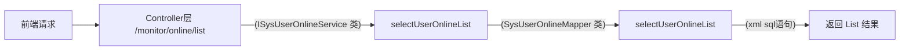

# `IOC`原理

## 仓库地址

## [若依](https://gitee.com/PapillonAz/web-framework-ruoyi/commits/master)

## `admin`模块

经过观察，发现里边只有controller模块，其他层都写到了`ruoyi-system`模块里面。


## `ruoyi-system`模块

包含了另外三层文件

+ domain

- mapper
- service


## `ruoyi-common`模块

发现里面都是一些公共的

配置类【config】，注解【annotation】，实体类【constant】，

核心基类【core】 ：公共基类，redis工具 文本工具 分页工具 等

枚举类【enums】，异常【exception】，过滤器【filter】，工具包【utils】


## `ruoyi-framework`模块

里面有一些:

切面【数据过滤处理、多数据源、日志记录】

配置类【各种组件的配置类，如：`redis`、MyBatis、线程池等…】

数据源【动态数据源、数据源切换】

拦截器

管理【异步工厂、异步任务器、关闭管理等…提升用户体验】

安全【这里阿昌下的是springsecurity的整合版本】

web


## `ruoyi-generator`模块

主要的一些模板类


## `ruoyi-quartz`模块

定时任务模块


# 分析具体被容器管理的类

这里以`ISysUserOnlineService`类为例

在`ruoyi-admin/src/main/java/com/ruoyi/web/controller/monitor/SysUserOnlineController.java`文件中，使用了`ISysUserOnlineService`类。


## 此类通过注解的方式交给`IOC`容器


使用的时候由容器进行创建和销毁。

## 该类的功能包括

+ 通过会话序号查询信息
+ 通过会话序号删除信息
+ 通过会话序号批量删除信息
+ 保存会话信息
+ 查询会话集合
+ 强退用户
+ 清理用户缓存
+ 通过失效日期查询信息

## 依赖的类

`SysUserOnlineMapper`


`SysUserOnlineMapper`类定义了查询的接口，并通过xml文件进行sql语句的绑定。

```java
public interface SysUserOnlineMapper
{
    /**
     * 通过会话序号查询信息
     * 
     * @param sessionId 会话ID
     * @return 在线用户信息
     */
    public SysUserOnline selectOnlineById(String sessionId);

    /**
     * 通过会话序号删除信息
     * 
     * @param sessionId 会话ID
     * @return 在线用户信息
     */
    public int deleteOnlineById(String sessionId);

    /**
     * 保存会话信息
     * 
     * @param online 会话信息
     * @return 结果
     */
    public int saveOnline(SysUserOnline online);

    /**
     * 查询会话集合
     * 
     * @param userOnline 会话参数
     * @return 会话集合
     */
    public List<SysUserOnline> selectUserOnlineList(SysUserOnline userOnline);

    /**
     * 查询过期会话集合
     * 
     * @param lastAccessTime 过期时间
     * @return 会话集合
     */
    public List<SysUserOnline> selectOnlineByExpired(String lastAccessTime);
}
```

```xml
<?xml version="1.0" encoding="UTF-8" ?>
<!DOCTYPE mapper
PUBLIC "-//mybatis.org//DTD Mapper 3.0//EN"
"http://mybatis.org/dtd/mybatis-3-mapper.dtd">
<mapper namespace="com.ruoyi.system.mapper.SysUserOnlineMapper">

	<resultMap type="SysUserOnline" id="SysUserOnlineResult">
		<id     property="sessionId"         column="sessionId"         />
		<result property="loginName"         column="login_name"        />
		<result property="deptName"          column="dept_name"         />
		<result property="ipaddr"            column="ipaddr"            />
		<result property="loginLocation"     column="login_location"    />
		<result property="browser"           column="browser"           />
		<result property="os"                column="os"                />
		<result property="status"            column="status"            />
		<result property="startTimestamp"    column="start_timestamp"   />
		<result property="lastAccessTime"    column="last_access_time"  />
		<result property="expireTime"        column="expire_time"       />
	</resultMap>
	
	<sql id="selectOnlineVo">
       select sessionId, login_name, dept_name, ipaddr, login_location, browser, os, status, start_timestamp, last_access_time, expire_time 
	   from sys_user_online
    </sql>
    
	<select id="selectOnlineById" parameterType="String" resultMap="SysUserOnlineResult">
		<include refid="selectOnlineVo"/>
		where sessionId = #{sessionId}
	</select>

	<insert id="saveOnline" parameterType="SysUserOnline">
		replace into sys_user_online(sessionId, login_name, dept_name, ipaddr, login_location, browser, os, status, start_timestamp, last_access_time, expire_time)
        values (#{sessionId}, #{loginName}, #{deptName}, #{ipaddr}, #{loginLocation}, #{browser}, #{os}, #{status}, #{startTimestamp}, #{lastAccessTime}, #{expireTime})
	</insert>
	
 	<delete id="deleteOnlineById" parameterType="String">
 		delete from sys_user_online where sessionId = #{sessionId}
 	</delete>
 	
 	<select id="selectUserOnlineList" parameterType="SysUserOnline" resultMap="SysUserOnlineResult">
		<include refid="selectOnlineVo"/>
		<where>
			<if test="ipaddr != null and ipaddr != ''">
				AND ipaddr like concat('%', #{ipaddr}, '%')
			</if>
			<if test="loginName != null and loginName != ''">
				AND login_name like concat('%', #{loginName}, '%')
			</if>
		</where>
	</select>
	
	<select id="selectOnlineByExpired" parameterType="String" resultMap="SysUserOnlineResult">
		<include refid="selectOnlineVo"/> o 
		WHERE o.last_access_time <![CDATA[ <= ]]> #{lastAccessTime} ORDER BY o.last_access_time ASC
	</select>

</mapper> 
```

## 调用链



## 运行结果


# 分析类`SysUser`

源文件如下

```java
package com.ruoyi.common.core.domain.entity;

/**
 * 用户对象 sys_user
 * 
 * @author ruoyi
 */
public class SysUser extends BaseEntity
{
    private static final long serialVersionUID = 1L;

    /** 用户ID */
    @Excel(name = "用户序号", cellType = ColumnType.NUMERIC, prompt = "用户编号")
    private Long userId;

    /** 部门ID */
    @Excel(name = "部门编号", type = Type.IMPORT)
    private Long deptId;

    /** 部门父ID */
    private Long parentId;

    /** 角色ID */
    private Long roleId;

    /** 登录名称 */
    @Excel(name = "登录名称")
    private String loginName;

    /** 用户名称 */
    @Excel(name = "用户名称")
    private String userName;

    /** 用户类型 */
    private String userType;

    /** 用户邮箱 */
    @Excel(name = "用户邮箱")
    private String email;

    /** 手机号码 */
    @Excel(name = "手机号码")
    private String phonenumber;

    /** 用户性别 */
    @Excel(name = "用户性别", readConverterExp = "0=男,1=女,2=未知")
    private String sex;

    /** 用户头像 */
    private String avatar;

    /** 密码 */
    private String password;

    /** 盐加密 */
    private String salt;

    /** 帐号状态（0正常 1停用） */
    @Excel(name = "帐号状态", readConverterExp = "0=正常,1=停用")
    private String status;

    /** 删除标志（0代表存在 2代表删除） */
    private String delFlag;

    /** 最后登录IP */
    @Excel(name = "最后登录IP", type = Type.EXPORT)
    private String loginIp;

    /** 最后登录时间 */
    @Excel(name = "最后登录时间", width = 30, dateFormat = "yyyy-MM-dd HH:mm:ss", type = Type.EXPORT)
    private Date loginDate;

    /** 密码最后更新时间 */
    private Date pwdUpdateDate;

    /** 部门对象 */
    @Excels({
        @Excel(name = "部门名称", targetAttr = "deptName", type = Type.EXPORT),
        @Excel(name = "部门负责人", targetAttr = "leader", type = Type.EXPORT)
    })
    private SysDept dept;

    private List<SysRole> roles;

    /** 角色组 */
    private Long[] roleIds;

    /** 岗位组 */
    private Long[] postIds;

    public SysUser()
    {

    }

    public SysUser(Long userId)
    {
        this.userId = userId;
    }

    public Long getUserId()
    {
        return userId;
    }

    public void setUserId(Long userId)
    {
        this.userId = userId;
    }

    public boolean isAdmin()
    {
        return isAdmin(this.userId);
    }

    public static boolean isAdmin(Long userId)
    {
        return userId != null && 1L == userId;
    }

    public Long getDeptId()
    {
        return deptId;
    }

    public void setDeptId(Long deptId)
    {
        this.deptId = deptId;
    }

    public Long getParentId()
    {
        return parentId;
    }

    public void setParentId(Long parentId)
    {
        this.parentId = parentId;
    }

    public Long getRoleId()
    {
        return roleId;
    }

    public void setRoleId(Long roleId)
    {
        this.roleId = roleId;
    }

    @Xss(message = "登录账号不能包含脚本字符")
    @NotBlank(message = "登录账号不能为空")
    @Size(min = 0, max = 30, message = "登录账号长度不能超过30个字符")
    public String getLoginName()
    {
        return loginName;
    }

    public void setLoginName(String loginName)
    {
        this.loginName = loginName;
    }

    @Xss(message = "用户昵称不能包含脚本字符")
    @Size(min = 0, max = 30, message = "用户昵称长度不能超过30个字符")
    public String getUserName()
    {
        return userName;
    }

    public void setUserName(String userName)
    {
        this.userName = userName;
    }

    public String getUserType()
    {
        return userType;
    }

    public void setUserType(String userType)
    {
        this.userType = userType;
    }

    @Email(message = "邮箱格式不正确")
    @Size(min = 0, max = 50, message = "邮箱长度不能超过50个字符")
    public String getEmail()
    {
        return email;
    }

    public void setEmail(String email)
    {
        this.email = email;
    }

    @Size(min = 0, max = 11, message = "手机号码长度不能超过11个字符")
    public String getPhonenumber()
    {
        return phonenumber;
    }

    public void setPhonenumber(String phonenumber)
    {
        this.phonenumber = phonenumber;
    }

    public String getSex()
    {
        return sex;
    }

    public void setSex(String sex)
    {
        this.sex = sex;
    }

    public String getAvatar()
    {
        return avatar;
    }

    public void setAvatar(String avatar)
    {
        this.avatar = avatar;
    }

    @JsonIgnore
    public String getPassword()
    {
        return password;
    }

    public void setPassword(String password)
    {
        this.password = password;
    }

    @JsonIgnore
    public String getSalt()
    {
        return salt;
    }

    public void setSalt(String salt)
    {
        this.salt = salt;
    }

    public String getStatus()
    {
        return status;
    }

    public void setStatus(String status)
    {
        this.status = status;
    }

    public String getDelFlag()
    {
        return delFlag;
    }

    public void setDelFlag(String delFlag)
    {
        this.delFlag = delFlag;
    }

    public String getLoginIp()
    {
        return loginIp;
    }

    public void setLoginIp(String loginIp)
    {
        this.loginIp = loginIp;
    }

    public Date getLoginDate()
    {
        return loginDate;
    }

    public void setLoginDate(Date loginDate)
    {
        this.loginDate = loginDate;
    }

    public Date getPwdUpdateDate()
    {
        return pwdUpdateDate;
    }

    public void setPwdUpdateDate(Date pwdUpdateDate)
    {
        this.pwdUpdateDate = pwdUpdateDate;
    }

    public SysDept getDept()
    {
        if (dept == null)
        {
            dept = new SysDept();
        }
        return dept;
    }

    public void setDept(SysDept dept)
    {
        this.dept = dept;
    }

    public List<SysRole> getRoles()
    {
        return roles;
    }

    public void setRoles(List<SysRole> roles)
    {
        this.roles = roles;
    }

    public Long[] getRoleIds()
    {
        return roleIds;
    }

    public void setRoleIds(Long[] roleIds)
    {
        this.roleIds = roleIds;
    }

    public Long[] getPostIds()
    {
        return postIds;
    }

    public void setPostIds(Long[] postIds)
    {
        this.postIds = postIds;
    }

    @Override
    public String toString() {
        return new ToStringBuilder(this,ToStringStyle.MULTI_LINE_STYLE)
            .append("userId", getUserId())
            .append("deptId", getDeptId())
            .append("loginName", getLoginName())
            .append("userName", getUserName())
            .append("userType", getUserType())
            .append("email", getEmail())
            .append("phonenumber", getPhonenumber())
            .append("sex", getSex())
            .append("avatar", getAvatar())
            .append("password", getPassword())
            .append("salt", getSalt())
            .append("status", getStatus())
            .append("delFlag", getDelFlag())
            .append("loginIp", getLoginIp())
            .append("loginDate", getLoginDate())
            .append("createBy", getCreateBy())
            .append("createTime", getCreateTime())
            .append("updateBy", getUpdateBy())
            .append("updateTime", getUpdateTime())
            .append("remark", getRemark())
            .append("dept", getDept())
			.append("roles", getRoles())
            .toString();
    }
}

```

可以看到并未交给`IOC`容器去管理此类。

有三处地方使用到了此类：


可以看到显示地去new，不交给容器管理的原因应该是

**简单性和轻量性要求：对于一些非常简单的类，可能不需要引入 Spring 框架来进行管理。这些类可能只是包含一些属性和简单的方法，没有复杂的依赖关系和业务逻辑。在这种情况下，使用 IOC 容器可能会增加额外的复杂性，而不是带来实际的好处。**


# 分析类`SpringUtils`

该类名为 `SpringUtils`，是一个工具类，用于在 Spring 应用中获取和操作 Bean。

该类实现了两个接口：`BeanFactoryPostProcessor` 和 `ApplicationContextAware`。

`BeanFactoryPostProcessor` 接口用于在 Spring 容器加载 Bean 的过程中，对 BeanFactory 进行后置处理。在 `postProcessBeanFactory` 方法中，将传入的 `beanFactory` 赋值给 `SpringUtils` 类中的静态变量 `beanFactory`。

`ApplicationContextAware` 接口用于获取应用上下文对象。在 `setApplicationContext` 方法中，将传入的 `applicationContext` 赋值给 `SpringUtils` 类中的静态变量 `applicationContext`。

接下来是一系列静态方法，用于通过 `beanFactory` 进行 Bean 的获取和操作：

- `getBean(String name)`：根据给定的 Bean 名称获取对应的 Bean 实例。
- `getBean(Class<T> clz)`：根据给定的 Bean 类型获取对应的 Bean 实例。
- `containsBean(String name)`：判断容器中是否包含指定名称的 Bean。
- `isSingleton(String name)`：判断指定名称的 Bean 是否为单例模式。
- `getType(String name)`：获取指定名称的 Bean 的类型。
- `getAliases(String name)`：获取指定名称的 Bean 的别名。

此外，还提供了其他一些功能方法：

- `getAopProxy(T invoker)`：获取 AOP 代理对象。
- `getActiveProfiles()`：获取当前活动的环境配置。
- `getActiveProfile()`：获取当前活动的环境配置中的第一个配置。
- `getRequiredProperty(String key)`：获取配置文件中指定键的值。


# 采用`IOC`管理，实现任意小功能

添加一个`ruoyi-bless`模块，实现一个小功能，控制台打印一行字符`-----------------------------------bless------------------------------------------------`,并跳转到登录界面


## 业务代码

```jaav
// controller 
@Controller
@RequestMapping("/bless")
public class BlessController {

    @Autowired
    private BlessService blessService;

    @GetMapping("/bless")
    public String build()
    {
        return blessService.bless();
    }
}


// Service
public interface BlessService {
   
    public String bless();   
}


// ServiceImpl
@Service
public class BlessServiceImpl implements BlessService{
    @Override
    public String bless() {
        System.out.println("-----------------------------------bless------------------------------------------------");
        return "login";
    }
}
```


## 运行结果


