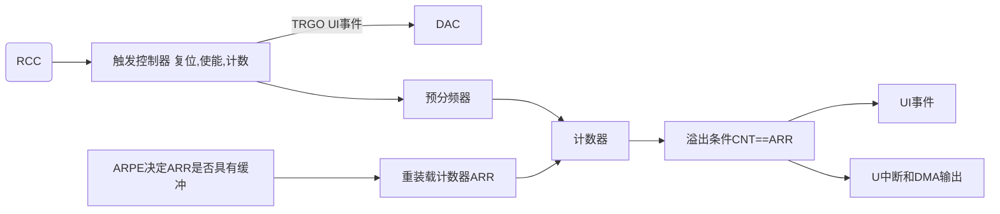
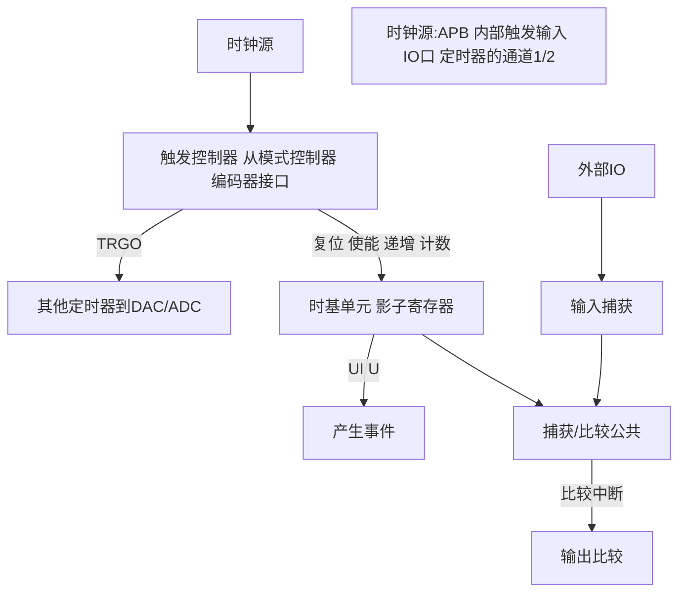

# STM32
## 常见术语
VDD: 电源正极 高电平
VSS: 电源负极 低电平


## 位操作
P置位第n位: P |= (1 << n)
Q清零第n位: Q &= ~(1 << n)
R反转第n位: R ^= (1 << n)
### 位带操作
转换: (Addr & 0xF0000000)+0x02000000+((Addr & 0x00ffffff)<<5) + (n<<2)
     

> 内存映射是对地址的封装，直接操作内存也可以实现。

## 引脚分类
电源
晶振IO
BOOT IO
复位IO
以上IO组成的系统称最小系统

## RCC
1. RCC_CR
2. RCC_CFGR
3. RCC_CIR
4. RCC_APB2RSTR
5. RCC_APB1RSTR
6. RCC_AHBENR
7. RCC_AHBENR
8. RCC_AHB2ENR
9. RCC_AHB1ENR
10. RCC_BDCR
11. RCC_CSR

## GPIO: 
专用总线:I2C, SPI, SDIO, FSMC, DCMI
普通总线: 蜂鸣器, LED, 按键
### 寄存器描述
1. CRL 配置低寄存器
2. CRH 配置高寄存器
3. ODR 输入数据寄存器
4. IDR 输入数据寄存器
5. BSRR 位设置/清楚寄存器
6. BRR 位清除寄存器
7. LCKR 配置锁定寄存器

```txt
1. 模拟输入: 不经过施密特触发器(TTL)直接接入
2. 浮空输入: 即高阻输入,相当于电压表。但外界没有输入时，容易受到外界电磁干扰.
3. 下拉输入: 无输入信号时端口电平被拉到低电平
4. 上拉输入: 无输入信号时端口电平被拉到高电平
5. 开漏输出: 只能输出低电平，只有接上拉电阻才能输出1。好处是更换外部电源即可以更改输出电源。
6. 推挽输出: 可以输出高低电平,高电平由VDD决定,低电平由VSS决定。由两个三极管互补信号控制,电流大,驱动能力强.
7. 复用开漏输出: 数据来自片上外设,而普通开漏输出来自输出数据寄存器(ODR)数据
8. 复用推挽输出: 同上

```

## IWDG 独立看门狗

递减计数器到0后，会自动复位，所以启用iwdg后要及时重装载计数器的值。12位，最大4096

是异常处理的最后手段，不可依赖，应在设计时尽量避免异常的发生。

没有中断，而WWDG有。

### 工作原理

启用iwdg后，LSI(内部低速时钟40khz)会自动开启

键寄存器iwdg_kr

```markdown
写入0xAAAA,喂狗
写入0x5555,解除pr和rlr寄存器的写保护
写入0xCCCC,启用iwdg工作
```

预分频寄存器iwdg_pr,设置时钟的预分频系数。psc=4*2^prer.

重装载寄存器iwdg_rlr,存放重装载值，低12位有效。

状态寄存器iwdg_sr,用于判断预分频值和重装载值是否已经被更改。

### 溢出时间计算

$$
T (out)=\frac{psc*rlr}{f_{iwdg}}=\frac{4*2^{prer}*rlr}{f_{iwdg}}， f_{iwdg}:iwdg的时钟频率
$$

## WWDG 窗口看门狗

主要用于检测软件异常

递减计数器，能产生系统复位信号和提前唤醒中断.

计数器从0x40减到0x3F时产生复位（即T6位跳变到0）

计数器值大于W[6:0]时喂狗会复位

提前唤醒中断(EWI):计数器等于0x40时可产生

在窗口期内重装载计数器的值，防止复位。

使用PCLK1外部总线时钟，计数器寄存器7位，最大127~63

### 工作原理

T[6:0]从0x7F(127)开始递减计数，减到W[6:0] (窗口上限值，大于这个值时喂狗会产生复位，在上限值和下限值之间喂狗不会产生复位)，减到0x40(64)时可产生中断，减到0x3F(63)(窗口下限值)，产生复位。

### 超时时间计算

WWDG_CR控制寄存器，[6:0]有效，计数器（MSB到LSB，T6为0会产生复位）,[7]是WDGA 激活位，`0:禁用WWDG；1:使能看门狗` 

WWDG_CFR:配置寄存器。T9 ：提前唤醒终端，计数器递减到0x40时产生中断，此中断中有复位后才能由硬件清零（还要使能NVIC）。T8:7 WDGTB:定时器时基。 2^WDGTB^计算分频器

WWDG_SR 状态寄存器。T0 EWIF： 提前唤醒中断标志，当计数器递减到0x40时由硬件置1.且只能由软件方式写0，如果不使能EWIF，此位也为1. 使能EWIF，信号会传到NVIC。

4096是固定预分频系数

### WWDG超时间计算

$$
T_{out}=\frac{4096*2^{WDGTB}*(T[5:0]+1)}{F_{wwdg}}
$$

### WWDG配置步骤

1. WWDG工作参数初始化 HAL_WWDG_Init()
2. WWDG MSP初始化 HAL_WWDG_MspInit() 配置NVIC,Clock等
3. 设置优先级，使能中断 HAL_NVIC_SetPriority() HAL_NVIC_Enable
4. 编写中断服务函数 WWDG_IRQHandler()-->HAL_WWDG_IRQHHandler
5. 重定义提前唤醒回调函数 HAL_WWDG_EarlyWakeupCallback()
6. 在窗口器内喂狗 HAN_WWDG_Refresh()

## 定时器

### 简介

#### 软件定时（cpu死等）

时钟频率分之一就是一条指令的时间，使用循环运行空指令__nop()来实现延时。不精准，且造成cpu资源浪费

```C
// stm32 延时
void delay_us(uint32_t us){
	us *= 72;
    while(us--);
}
```

 #### 定时器原理

时钟源（精准时钟），经过预分频器，到计数器计数，产生溢出表示时间到了，自动重装载寄存器会把计时器重装载。

#### 计时器分类

1. 常规定时器

> 基本/通用/高级定时器

2. 专用定时器

> 独立看门狗，窗口看门狗，实时时钟TRC，低功耗定时器

3. 内核定时器

> SysTick定时器

#### 定时器特征表

有八个定时器: 基本TIM6/7; 通用TIM2/3/4/5; 高级TIM1/8

F1特征表（芯片不一样要查手册 ）:

| 类型 |    定时器    | 位数 |计数模式| 预分频系数 | DMA请求 | 捕获/比较通道 | 互补输出 |
| :--: | :----------: | :--: | :----------------: | :--------: | :-----: | :-----------: | :------: |
| 基本 |    TIM6/7    |  16  |        递增        |  1~65535   |   yes   |       0       |    no    |
| 通用 | TIME2 /3/4/5 |  16  | 递增/递减/中央对齐 |  1~65535   |   yes   |       4       |    no    |
| 高级 |    TIM1/8    |  16  | 递增/递减/中央对齐 |  1~65535   |   yes   |       4       |   yes    |

#### 区别

| 类型 |                           主要功能                           |
| ---- | :----------------------------------------------------------: |
| 基本 |           只有输入输出通道，常用作时基，即定时功能           |
| 通用 |   具有多路独立通道，可用于输入捕获/输出比较，可以用作时基    |
| 高级 | 除既有通用的功能外，还具备带死区控制的互补信号输出，刹车输入等功能（可用于电机控制，数字电源设计等） |


### 基本定时器

#### 简介

1. TIM6/7
2. 特性：16位递增计时器(0~65535)，16位预分频器(1-65536)，可触发DAC，在更新事件时，可产生中断/DMA请求

#### 框图



#### 计数模式及溢出条件

| 计数器模式 | 溢出条件                |
| ---------- | ----------------------- |
| 递增       | CNT==ARR(max)           |
| 递减       | CNT==0                  |
| 中心对齐   | CNT == ARR-1,  CNT == 1 |

#### 计时器终端相关寄存器

> TIMx_CR1
>
> bit7 ARPE: 自动重装载预装载使能，决定ARR寄存器是否有缓冲
>
> bit0 CEN: 计数器使能

> TIMx_DIER
>
> bit8 UDE: 更新DMA请求使能
>
> bit0 UIE: 更新中断使能

> TIMx_SR
>
> bit0 UIF: 更新中断标志

> TIMx_CNT
>
> bit[15:0] 计数器数值

> TIMx_PSC	实际起作用是它的影子寄存器
>
> bit[15:0] 预分频数值

> TIMx_ARR    实际起作用是它的影子寄存器
>
> bit[15:0] 自动重装载数值

#### 寄存器溢出时间计算方法

$$
T_{out}=\frac{(ARR+1)*(PSC+1)}{F_t}
$$

#### 定时器中断实验配置步骤

1. HAL_TIM_Base_Init()
2. HAL_TIM_Base_MspInit(), NVIC, CLOCK etc.
3. HAL_TIM_Base_Start_IT()
4. HAL_NVIC_SetPriority(), HAL_NVIC_EnableIRQ()
5. TIMx_IRQGandler() -> HAL_TIM_IRQHandler()

### 通用定时器

#### 框图




#### 时钟源


### 高级定时器


# 构建HAL库工程（不使用cubemx）

## 必须文件

1. stm32f1xx_hal_conf.h	通过宏定义来include相应的外设头文件
2. stm32f1xx_it.h/c 中断相关的代码，weak声明的函数需要重定义
3. system_stm32f1xx.c 内核级别的依赖程序，系统内核时钟，总线时钟等
4. stm32f1xx_hal_msp.c 板级支持包，MCU相关的硬件初始化操作

## 初始化流程

1. HAL_Init(): 外设 flash 中断优先级 systemtick等
2. SystemClock_Config(): 配置倍频和总线频率
3. 外设初始化

# st-link 烧录程序

## 常用命令
> st-flash reset

> st-info --probe

> st-flash read out.bin 0x8000000 0x40000

> st-flash write xxx.bin 0x8000000


# Arm-none-eabi-gcc

## 二进制复制

`arm-none-eabi-objcopy -O binary xxx.elf xxx.bin`


# PlatforIO

## openocd权限问题

`sudo chown -R papillon:users /dev/stlinkv2_4  `


# GDB stlink调试程序

1. arm-none-eabi-as -mthumb  -mcpu=cortex-m3 -g xxx.s -o xxx.o        `-mthumb (16位指令集)`
2. arm-none-eabi-ld xxx.o -T xxx.ld -o xxx.elf
3. 先编译程序下载到板子上
4. 运行`st-util`命令来打开 gdbserver, 并记住端口号 ${port}
5. arm-none-eabi-gdb xx.elf
6. target remote *: ${port} 
7. stepi , next, finish, list , continue ，- (图形界面)，info break, display, bt (查看堆栈),  jump <linenum> 跳转到第几行， x (打印地址的值) 等命令


# 串口工具

## minicom

`sudo minicom -s` 配置参数

`sudo minicom -D /dev/bus/usb/001/012` 连接串口

`ctrl_A Z`菜单


# ARM 汇编
## 寄存器

> cortex-M 系列使用armv7架构，使用thumb 指令集(T32)

模式: User, FIQ, IRQ, ABT, SVC, UND, MON, HYP
* 1. R0-R12通用寄存器，放通用数据，32bit
* 2. 各个模式R0-R12与User模式是共享的（除了 FIQ的R8-R12), PC, CPSR 是共享的
* 3. USER模式没有SPSR
> SP 栈指针，存储栈地址
> LR 链接寄存器，存储子程序返回地址
> PC 程序计数器
> APSR/CPSR 应用程序状态寄存器/当前程序状态寄存器
