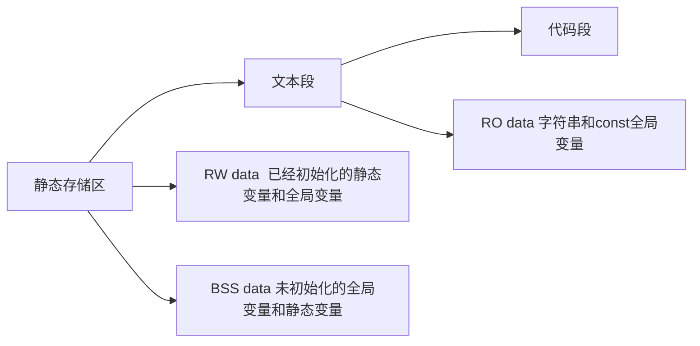
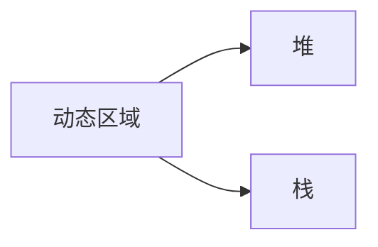
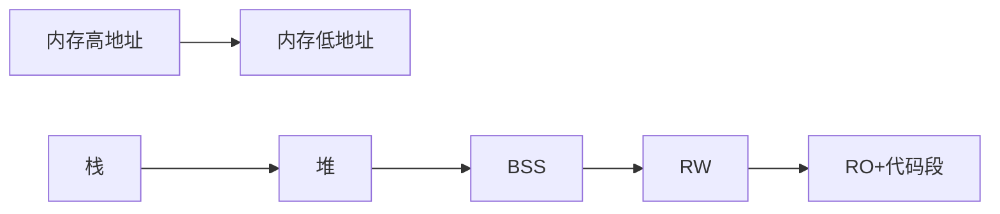

# Linux
## 线程与进程

在学习Linux的知识时，书上经常会有线程和进程的提法，在Linux内核中，其实是不区分进程还是线程的。

Linux kernel会使用一个统一的task_struct (进程描述符)来描述任务相关的所有信息。

然而我们该怎么样来理解程序，进程，线程的区别呢？

**程序**：程序是**静态**的说法，它是保存在某种介质（磁盘）上的**可执行文件**，是code与data的集合。

**进程**：处于**执行状态**的程序以及它所包含的资源的总称，进程是一个程序的**动态的执行的实体**。

**线程**：线程是进程中的一个动态对象，是程序**执行的最小单元**。

一个进程中可能包含有多个线程，这些线程会共享同一个进程中的资源。例如地址空间，所打开的文件等。

从实际的例子来看，假如我们生成了一个可执行的程序，它保存在文件中时，就是程序；

一旦系统开始调度这个程序执行，那么它可以称为一个进程。

在这个进程中可能会有不同的线程，例如很可能存在tcp thread， ip thread，以及其它为了完成某一功能而创建的thread。

由于我们在嵌入式Linux Kernel实际工作中使用的还是线程的概念，因此之后的讨论一概以线程来称呼。

线程描述符  task_struct  (可以参考`/usr/include/linux/sched.h`)中包含了一个线程相关的所有信息，里面主要描述了线程的状态，虚拟内存空间信息，寄存器和堆栈上下文等。

## 物理/虚拟 地址转换
地址 `0x0000 0000 0000 0000 - 0x0000 7FFF FFFF FFFF` 共128T（47位），属于用户空间；地址 `0xFFFF 8000 0000 0000 - 0xFFFF FFFF FFFF FFFF` 共128T（47位）， 属于内核空间


### PAGE_OFFSET
PAGE_OFFSET 代表的是内核空间和用户空间对虚拟地址空间的划分，不同的体系结构定义和值都不同。比如在32位系统中`3G-4G`属于内核使用的内存空间，所以 `PAGE_OFFSET = 0xC000 0000。在X86-64架构下是0xffff 8800 0000 0000`。

### 宏`__pa` 用来把虚拟地址转换为物理地址
```C
 // file: arch/x86/include/asm/page_64.h
 #define __phys_addr(x)      __phys_addr_nodebug(x)
 ​
 static inline unsigned long __phys_addr_nodebug(unsigned long x)
 {
     unsigned long y = x - __START_KERNEL_map;
 ​
     /* use the carry flag to determine if x was < __START_KERNEL_map */
     x = y + ((x > y) ? phys_base : (__START_KERNEL_map - PAGE_OFFSET));
 ​
     return x;
 }
```
宏 `__START_KERNEL_map` （ `_0xffff ffff 8000 0000_`）是虚拟地址中**内核代码映射区**的起始地址； `__PAGE_OFFSET`（`_0xffff 8800 0000 0000_`）是**物理内存直接映射区**的起始地址。

`y = x - __START_KERNEL_map`计算待转换虚拟地址和**内核代码映射区**起始地址的差值：

- 当 _x > y_ 时，说明待转换虚拟地址处于**内核代码映射区**，返回值 _x = y + phys_base_。根据本文第八节可知，`phys_base`是内核映射区的物理基地址，`y + phys_base`就是 _x_ 的物理地址。
- 当 _x < y_ 时，说明待转换虚拟地址处于**物理内存直接映射区**，返回值 `x = y + __START_KERNEL_map - PAGE_OFFSET`。`y + __START_KERNEL_map`会回绕到 _x_，所以最终 `x = x - PAGE_OFFSET`，得到 _x_ 的物理地址。

### 宏 __va
宏__va 将物理地址转虚拟地址，定义如下：

 `// file: arch/x86/include/asm/page.h`
```C
#define __va(x)         ((void *)((unsigned long)(x)+PAGE_OFFSET))
```

可以看到，将物理地址直接加上 PAGE_OFFSET，得到虚拟地址。


## 哈佛结构和冯诺依曼结构的区别

要理解哈弗结构和冯诺依曼结构的区别，首先要知道我们在编写程序的时候其实可以对程序的代码划分为两个部分，**一部分**是程序编写完成后就不再需要对其进行修改了的（也就是逻辑代码部分）**另一部分**就是在程序编写完毕后其内容会随着程序的运行而不断变化的部分（也就是定义变量）。而哈佛结构和冯诺依曼结构就是对于这个两部分代码的存储方式的区别。

哈佛结构(Harvard architecture)是一种将**程序指令储存和数据储存分开**的存储器结构。

中央处理器首先到程序指令储存器中读取程序指令内容，解码后得到数据地址，再到相应的数据储存器中读取数据，并进行下一步的操作（通常是执行）。程序指令储存和数据储存分开，数据和指令的储存可以同时进行，可以使指令和数据有不同的数据宽度。

哈佛结构的微处理器通常具有较高的执行效率。其程序指令和数据指令分开组织和储存的，执行时可以预先读取下一条指令。
大多数ARM、DSP是哈佛结构。

冯.诺伊曼结构（von Neumann architecture）是一种将**程序指令存储器和数据存储器合并在一起**的存储器结构。

大多数CPU和GPU是冯诺依曼结构的。

冯诺依曼结构则是将逻辑代码段和变量统一都存储在内存当中，他们之间一般是按照代码的执行顺序依次存储。这样就会导致一个问题，如果当程序出现BUG的时候，由于程序没有对逻辑代码段的读写限定，因此，他将拥有和普通变量一样的读写操作权限。于是就会很容易的死机，一旦他的逻辑执行出现一点改变就会出现非常严重的错误。但是，冯诺依曼结构的好处是可以充分利用有限的内存空间，并且会使CPU对程序的执行十分的方便，不用来回跑。


## 简述任务/线程之间的同步方式

互斥锁：锁机制是同一时刻只允许一个线程执行一个关键部分的代码。

条件变量：条件变量是利用线程间共享全局变量进行同步的一种机制。条件变量上的基本操作有：触发条件(当条件变为 true 时)，等待条件，挂起线程直到其他线程触发条件。

信号量：为控制一个具有有限数量用户资源而设计。

事 件：用来通知线程有一些事件已发生，从而启动后继任务的开始。

临界区（Critical Section）

　　保证在某一时刻只有一个线程能访问数据的简便办法。在任意时刻只允许一个线程对共享资源进行访问。如果有多个线程试图同时访问临界区，那么在有一个线 程进入后其他所有试图访问此临界区的线程将被挂起，并一直持续到进入临界区的线程离开。临界区在被释放后，其他线程可以继续抢占，并以此达到用原子方式操 作共享资源的目的。

## 可执行程序的内存布局







## Linux的用户态与内核态的转换方法

解答：**Linux下内核空间与用户空间进行通信的方式主要有syscall（system call）、procfs、ioctl和netlink等。**

- **syscall：**一般情况下，用户进程是不能访问内核的。它既不能访问内核所在的内存空间，也不能调用内核中的函数。**Linux内核中设置了一组用于实现各种系统功能的子程序，用户可以通过调用他们访问linux内核的数据和函数，这些系统调用接口（SCI）称为系统调用；**
- **procfs：是一种特殊的伪文件系统 ，是Linux内核信息的抽象文件接口，大量内核中的信息以及可调参数都被作为常规文件映射到一个目录树中**，这样我们就可以简单直接的通过echo或cat这样的文件操作命令对系统信息进行查取；
- **netlink：用户态应用使用标准的 socket API 就可以使用 netlink 提供的强大功能；**
- **ioctl：函数是文件结构中的一个属性分量，就是说如果你的驱动程序提供了对ioctl的支持，用户就可以在用户程序中使用ioctl函数控制设备的I/O通道。**

## 打开文件

linux系统打开设备文件，进程可能处于三种基本状态，如果多次打开设备文件，驱动程序应该实现什么？

当进程打开设备文件时，它可能处于以下三种基本状态之一：

1. 阻塞状态（Blocking State）：
   进程在打开设备文件时，如果设备当前不可用或没有准备好接收进程的操作，进程可能会进入阻塞状态。在阻塞状态下，进程将暂停执行，并等待设备就绪或可用。
2. 非阻塞状态（Non-blocking State）：
   进程可以选择以非阻塞方式打开设备文件。在非阻塞状态下，如果设备当前不可用，进程将继续执行而不会等待设备就绪。它可以立即返回错误或特定的状态码，使进程能够继续执行其他任务。
3. 异步状态（Asynchronous State）：
   进程可以选择以异步方式打开设备文件。在异步状态下，进程可以提交设备操作请求，并在后续完成时得到通知。进程可以继续执行其他任务，不需要等待设备操作完成。一旦设备操作完成，进程将收到通知，可以通过回调或其他机制来处理完成的操作。

当多个进程同时打开设备文件时，驱动程序应该实现适当的并发控制机制来确保对设备的访问是安全和一致的。例如，可以使用互斥锁或信号量来保护共享资源，防止并发访问导致的冲突。驱动程序还应该处理并发操作的同步和调度，以确保设备状态的一致性和正确性。

需要注意的是，具体的实现方式取决于驱动程序的设计和要求。不同的设备和驱动程序可能具有不同的并发控制要求和机制。在开发驱动程序时，应仔细考虑并发访问的可能性，并采取适当的措施来处理并发操作。

## 无锁方案

无锁可以提高整个程序的性能，但是CPU需要对此提供支持，请以x86/ARM为例简述。

解答：无锁编程具体使用和考虑到的技术方法包括：原子操作（atomic operations）, 内存栅栏（memory barriers）, 内存顺序冲突（memory order）， 指令序列一致性（sequential consistency）和顺ABA现象等等。

在这其中最基础最重要的是操作的原子性或说原子操作。原子操作可以理解为在执行完毕之前不会被任何其它任务或事件中断的一系列操作。原子操作是非阻塞编程最核心基本的部分，没有原子操作的话，操作会因为中断异常等各种原因引起数据状态的不一致从而影响到程序的正确。

对于原子操作的实现机制，在硬件层面上CPU处理器会默认保证基本的内存操作的原子性，CPU保证从系统内存当中读取或者写入一个字节的行为肯定是原子的，当一个处理器读取一个字节时，其他CPU处理器不能访问这个字节的内存地址。但是对于复杂的内存操作CPU处理器不能自动保证其原子性，比如跨总线宽度或者跨多个缓存行（Cache Line），跨页表的访问等。这个时候就需要用到CPU指令集中设计的原子操作指令，现在大部分CPU指令集都会支持一系列的原子操作。

而在无锁编程中经常用到的原子操作是Read-Modify-Write  （RMW）这种类型的，这其中最常用的原子操作又是 COMPARE AND SWAP（CAS），几乎所有的CPU指令集都支持CAS的原子操作，比如X86平台下中的是 CMPXCHG（Compare Are Exchange）。

继续说一下CAS，CAS操作行为是比较某个内存地址处的内容是否和期望值一致，如果一致则将该地址处的数值替换为一个新值。CAS操作具体的实现原理主要是两种方式：总线锁定和缓存锁定。所谓总线锁定，就是CPU执行某条指令的时候先锁住数据总线的， 使用同一条数据总线的CPU就无法访问内存了，在指令执行完成后再释放锁住的数据总线。锁住数据总线的方式系统开销很大，限制了访问内存的效率，所以又有了基于CPU缓存一致性来保持操作原子性作的方法作为补充，简单来说就是用CPU的缓存一致性的机制来防止内存区域的数据被两个以上的处理器修改。

最后这里随便说一下CAS操作的ABA的问题，所谓的ABA的问题简要的说就是，线程a先读取了要对比的值v后，被线程b抢占了，线程b对v进行了修改后又改会v原来的值，线程1继续运行执行CAS操作的时候，无法判断出v的值被改过又改回来。

解决ABA的问题的一种方法是，一次用CAS检查双倍长度的值，前半部是指针，后半部分是一个计数器；或者对CAS的数值加上版本号。 

## 进程通讯方式

操作系统提供了多种进程间通信（Inter-Process Communication，IPC）的方式，用于不同进程之间的数据交换和协作。以下是几种常见的 IPC 方式：

1. 管道（Pipe）：
    管道是一种半双工的通信方式，通常用于具有父子关系的进程间通信。它可以在一个进程写入数据时，另一个进程从管道中读取数据。在 Linux 中，有两种类型的管道：无名管道（使用 `pipe()` 系统调用）和有名管道（使用 `mkfifo()` 系统调用）。
2. 共享内存（Shared Memory）：
    共享内存是一种高效的进程间通信方式，它允许多个进程共享同一块内存区域。进程可以直接读写共享内存，而无需通过内核进行数据拷贝。在 Linux 中，可以使用 `shmget()`、`shmat()` 和 `shmdt()` 等系统调用来创建和操作共享内存。
3. 信号量（Semaphore）：
    信号量是一种用于进程间同步和互斥的通信方式。它可以用于限制同时访问共享资源的进程数量。进程可以通过对信号量进行 P（等待）和 V（释放）操作来获取和释放资源。在 Linux 中，可以使用 `semget()`、`semop()` 和 `semctl()` 等系统调用来创建和操作信号量。
4. 消息队列（Message Queue）：
    消息队列是一种通过在进程间传递消息来进行通信的方式。进程可以将消息发送到队列，其他进程则可以从队列中接收消息。消息队列可以实现异步通信和解耦合。在 Linux 中，可以使用 `msgget()`、`msgsnd()` 和 `msgrcv()` 等系统调用来创建和操作消息队列。
5. 套接字（Socket）：
    套接字是一种可用于不同主机之间或同一主机上不同进程间进行通信的方法。套接字可以基于网络协议（如 TCP/IP）或本地协议（如 UNIX 域套接字）进行通信。在 Linux 中，可以使用 `socket()`、`bind()`、`listen()`、`accept()`、`connect()` 和 `send()`、`recv()` 等系统调用来创建和操作套接字。

